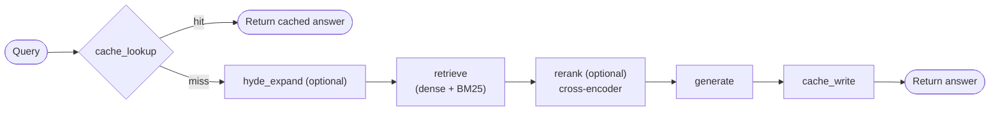
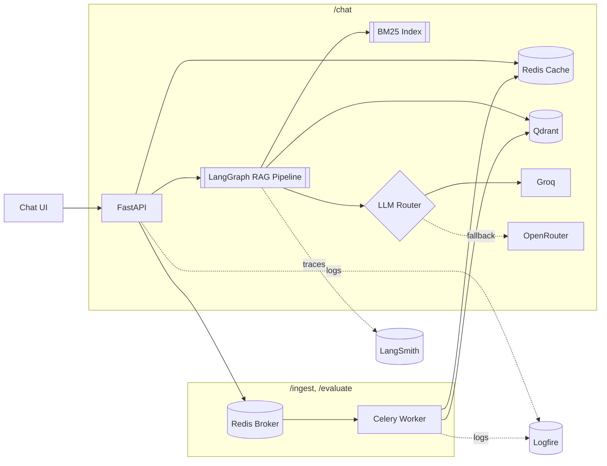

# RAG Application

Enterprise-grade Retrieval-Augmented Generation application demonstrating
production system design: hybrid retrieval with query expansion and
reranking, caching, async queues, dual observability (LangSmith +
Logfire), evaluation-driven iteration, and a clean hexagonal
architecture.

## Tech Stack

| Component | Technology |
|-----------|------------|
| Orchestration | LangChain + LangGraph |
| LLM | Groq (primary) → OpenRouter (fallback) |
| Embeddings | FastEmbed (local, no API key) |
| Vector DB | Qdrant |
| Keyword search | BM25 (`rank-bm25`) |
| Reranking | Local cross-encoder (FastEmbed ONNX) |
| Cache + Broker | Redis |
| Task Queue | Celery |
| Backend | FastAPI |
| Frontend | Static HTML/CSS/JS chat UI, served by FastAPI |
| Deployment | Docker Compose |
| LLM Observability | LangSmith |
| Infra Observability | Logfire |
| Evaluation | RAGAS |

## Retrieval Pipeline

The RAG pipeline is a LangGraph state graph:



- **HyDE (optional):** generates a hypothetical answer passage and blends
  its embedding with the raw query's, closing the vocabulary gap between
  question-style queries and source prose.
- **Hybrid retrieval:** dense vector search (Qdrant) is merged with BM25
  keyword search before reranking, catching exact-term matches that
  dense embeddings under-weight.
- **Cross-encoder reranking:** a local ONNX cross-encoder re-scores a
  widened candidate pool and trims it back to the requested `top_k`
  before generation, so the LLM's context size is unaffected by how wide
  the candidate pool was.
- **Evaluation-driven:** each of the above was validated against a RAGAS
  harness (`make eval`) over a hand-authored Q&A set — faithfulness and
  context precision as primary signals, answer relevancy and context
  recall as secondary — rather than shipped on intuition.

## Quick Start

### Prerequisites
- Docker & Docker Compose
- [uv](https://docs.astral.sh/uv/) package manager (only needed for native development or the `make` helper scripts below)

### Run the full stack (one command)

```bash
cp .env.example .env   # fill in your API keys
make up                 # or: docker compose up -d --build
```

This builds and starts all four services — Qdrant, Redis, the Celery
worker, and FastAPI — wired together on one Docker network. FastAPI also
serves the chat UI directly, so there's a single entry point:

- Chat UI: http://localhost:8000
- API docs: http://localhost:8000/docs

Seed the sample documents once the stack is up:

```bash
uv sync   # local venv, only needed to run this script
uv run python scripts/seed_vectorstore.py
```

Bring the stack down with `make down` (or `docker compose down`).

### Native development (faster iteration, no image rebuilds)

Run each piece directly on the host instead, useful when actively
editing code:

```bash
uv venv && uv sync
docker compose up -d qdrant redis   # just the two stateful dependencies
make seed     # seed sample documents
make dev      # FastAPI (serves the chat UI too), with --reload
make worker   # in another terminal: Celery worker
```

### Other commands

```bash
make eval   # Run the RAGAS evaluation harness against the seeded corpus
make test   # Run the test suite
make lint   # Run ruff
```

## Usage

```bash
curl -X POST http://localhost:8000/chat \
  -H "Content-Type: application/json" \
  -d '{"query": "What is the attention mechanism in the Transformer paper?", "top_k": 5}'
```

```json
{
  "request_id": "f3a1c9e2-...",
  "answer": "The Transformer computes attention as a weighted sum over value vectors, where the weights come from a compatibility function between the query and each key... [Source 1]",
  "sources": [
    {
      "content": "The Attention function can be described as mapping a query...",
      "source_id": "attention_is_all_you_need",
      "chunk_index": 12,
      "score": 8.42,
      "filename": "attention_is_all_you_need.pdf"
    }
  ],
  "cached": false,
  "llm_provider": "groq",
  "llm_model": "openai/gpt-oss-20b",
  "latency_ms": 4213.7
}
```

`POST /chat/stream` streams the same pipeline as Server-Sent Events —
tokens arrive as they're generated instead of waiting for the full
answer, cutting perceived latency during the multi-second generation
phase. A cache hit still returns instantly as one event rather than
being drawn out token-by-token. The chat UI uses this endpoint; `/chat`
remains available for non-streaming callers.

`GET /documents` lists every ingested document (aggregated by source),
powering the UI's document list.

Document ingestion (`POST /ingest`) and evaluation runs (`POST /evaluate`)
are asynchronous — both return a Celery task ID immediately, pollable at
`GET /ingest/status/{task_id}` and `GET /evaluate/status/{task_id}`
respectively.

## Architecture



- **Hexagonal design:** every external dependency (LLM, vector store,
  cache, task queue, reranker, keyword search) sits behind an abstract
  interface in `core/interfaces.py`; concrete providers are swapped in
  via dependency injection, never imported directly by route handlers.
- **LLM fallback router:** requests try Groq first and fall back to
  OpenRouter on any error, so a single provider outage or rate limit
  doesn't take the app down.
- **Cache-aside pattern:** answers are cached in Redis, keyed on the
  normalized query plus a collection-version counter that invalidates
  the whole cache on new ingestion.
- **Async ingestion:** document ingestion runs as a Celery task with
  progress reporting and retry/backoff, so large uploads don't block the
  API.

### Project structure

```
src/rag_app/
├── api/            FastAPI routes, request/response schemas, DI
├── core/           Abstract interfaces (the hexagonal boundary)
├── rag/            LangGraph state, nodes, and graph builder
├── ingestion/      Loading, chunking, and the ingestion Celery task
├── retrieval/      BM25 keyword search
├── reranking/      Cross-encoder reranker
├── embeddings/     FastEmbed provider
├── vectorstore/    Qdrant store
├── llm/            Groq/OpenRouter providers + fallback router
├── caching/        Redis cache-aside
├── queue/          Celery app + task queue abstraction
├── evaluation/     RAGAS harness, dataset, and eval Celery task
├── observability/  LangSmith + Logfire configuration
└── config/         Settings
```

## Observability

Two backends, split by concern:

- **LangSmith** traces the LLM pipeline — every LangGraph node (cache
  lookup/write, retrieve, rerank, HyDE, generate) is automatically traced
  as a child run, with full prompt/completion and token detail for each
  LLM call.
- **Logfire** traces everything else — the HTTP layer, Redis cache
  hit/miss/set events, Celery task lifecycle, BM25 index rebuilds, and
  LLM provider routing (primary/fallback).

Each `/chat` request carries a `request_id` attached to both the Logfire
span and the LangSmith run metadata, so a single request can be traced
end-to-end across both tools. The evaluation harness uses the same
pattern: every question is tagged with an `eval_run_id` and `question_id`
that tie its LangSmith trace back to the matching Logfire event.

**Viewing them:** LangSmith traces appear at
[smith.langchain.com](https://smith.langchain.com) under the project
named by `LANGSMITH_PROJECT`. Logfire traces appear at the project URL
printed to stdout when the API or worker starts
(`https://logfire-us.pydantic.dev/<org>/<project>`). Both require their
respective API key in `.env`; with no key set, Logfire still logs to the
local console and LangSmith tracing is simply disabled.

Latency characteristics observed in practice:
- The cross-encoder reranker + BM25 hybrid search add roughly 3.5–6s+ per
  `/chat` request (surfaced directly in `ChatResponse.latency_ms`) — the
  cost of the retrieval-quality improvement measured during evaluation.
- Cache hits skip the pipeline entirely — no retrieval, reranking, or
  generation runs.
- In evaluation runs, RAGAS's judge scoring is timed separately from
  pipeline execution (`pipeline_duration_ms` / `judge_duration_ms`) and
  is typically the larger share of total run time.
- The BM25 index is rebuilt once at API startup and lazily on first use
  otherwise; a rebuild scans and tokenizes the full collection.

## Evaluation Results

Output from `make eval` against the 15-question hand-authored Q&A set,
dense-only retrieval vs. the cross-encoder reranker + BM25 hybrid:

```
Dense retrieval only

Metric              Score     Coverage    Signal
------------------------------------------------------------
faithfulness        0.8429    14/15       primary
context_precision   0.7411    15/15       primary
answer_relevancy    0.7678    13/15       secondary
context_recall      0.6786    14/15       secondary
```

```
Reranker + BM25 hybrid

Metric              Score     Coverage    Signal
------------------------------------------------------------
faithfulness        0.9167    3/15        primary -- PARTIAL, interpret with caution
context_precision   0.8608    5/15        primary -- PARTIAL, interpret with caution
answer_relevancy    0.6922    8/15        secondary
context_recall      0.8333    9/15        secondary
```

Coverage below 15/15 means some judge calls failed on transient errors
rather than a real scoring gap — the harness reports mean and coverage
separately instead of silently averaging over whichever rows happened to
succeed, so a partial sample is never mistaken for a full-dataset score.

## Known Limitations

- The BM25 index doesn't refresh automatically when new documents are
  ingested — it's rebuilt once at API startup and otherwise needs an
  explicit `rebuild()` call.
- The Celery worker runs a single-process pool (`--pool=solo`) rather
  than a multiprocess one, a deliberate trade-off for the reranker's
  ONNX runtime, which isn't safe to use across forked worker processes.
  This bounds ingestion throughput to one document at a time.
- Single-node deployment — no horizontal scaling or load balancing is
  configured for the API or worker.

## Environment Variables

See `.env.example` for all required and optional variables.